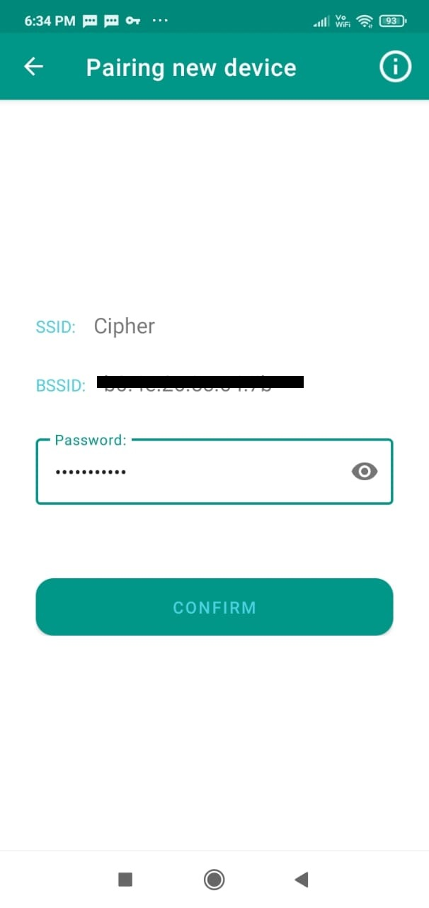
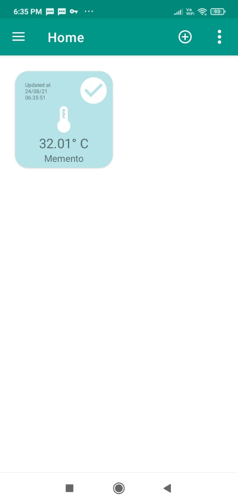

# IOTMemento

## Introduction
This hardware was fabricated for AICTE Idea Lab FDP held at TI-CEPD, NSUT.
This repository is hosting tempalte code with Pinmapping and libraries information used during FDP. 
Also, An Android app is provided to view the data of the temperature form the hardware.
Features of this device are as follows:- 
1. Before wifi provisioning :- 

*  Rainbow pattern on RGB
*  Every 10 seconds all 12 petal leds will glow in linear fashion.

2. After wifi provisioning

* Rainbow pattern on RGB
* Play mario death tone every hour at 00 minute.
* Each of 12 petal leds will glow one after another in clockwise fashion, denoting complition of 5 minutes.

### Android APP
There is an Android application available at the play store for provisioning of the device (i.e. providing wifi ssid and passsword) and relaying the information.

Application can be located at https://play.google.com/store/apps/details?id=com.sincgrid.sincgridhome

Below are the steps needed to commision the device
1. Regsiter user
2. WiFi provision of the device
3. Regualr temperature update on the card

#### Registering the user
* After opening the app, Click on the Register button. 

* Fill in the details

* On provided email id, an OTP will be send. 

* After confirming the OTP you will be logged in into the application.

#### WiFi provision of the device

* On App side Click on the add button to start provisioning

* On device side, Press the button for 5 second, you will hear a buzzer beep that mark as confirmation of initiation of provisioning.

* To whatever the wifi you phone is connected, that SSID will be taken by default. To change this, you can switch the wifi form the phone.

* Please provide the credentials of the the ssid.

After this app will automatically add the device.

#### Regualr temperature update on the card
After every 15 minutes device will send the temperature data from LM75.
